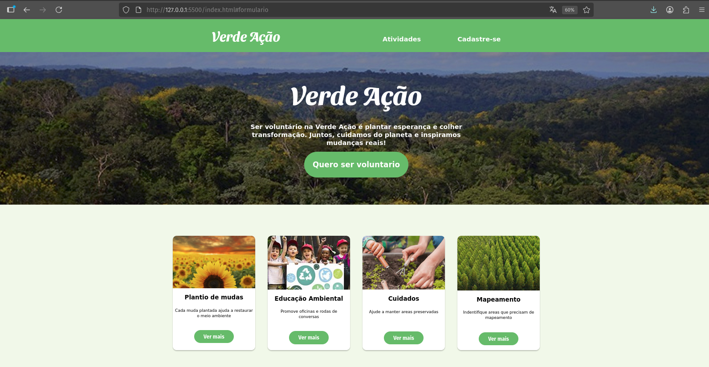

# Projeto Landing Page: Verde Ação

Esta é uma landing page estática para a "Verde Ação", uma organização fictícia de voluntariado ambiental. O objetivo da página é apresentar as atividades da organização e capturar o cadastro de novos voluntários através de um formulário.

## 🖼️ Visão Geral

A página é composta por quatro seções principais:

1.  **Hero Section:** Uma introdução com uma imagem de fundo, o título da organização e um botão "Call to Action" (CTA) que leva ao formulário.
2.  **Cards de Atividades:** Apresentação visual das diferentes frentes de voluntariado (Plantio, Educação Ambiental, etc.).
3.  **Formulário de Cadastro:** Campos para coletar dados dos interessados (Nome, E-mail, Cidade e Atividade).
4.  **Rodapé:** Informações de copyright.

## 🖼️ Figma do Projeto

https://www.figma.com/design/EaumLQKHhPAeqajtGPeEzi/Verde-A%C3%A7%C3%A3o---Karynne-e-Fernanda?node-id=4004-18&t=lYxzQrFQqVjAEp3N-0

## 💡 Desafio de Layout

O principal desafio deste projeto foi construir o layout **sem utilizar Flexbox ou Grid**.

Toda a estrutura e alinhamento dos elementos foram feitos usando técnicas de CSS tradicionais, incluindo:

- `display: inline-block` para posicionar elementos lado a lado (como o cabeçalho e os cards).
- `text-align: center` no contêiner pai para centralizar os blocos `inline-block`.
- `vertical-align: top` nos cards para corrigir o desalinhamento causado por diferentes quantidades de texto.
- `margin: auto` para centralização horizontal de blocos com largura definida.

## 🛠️ Tecnologias Utilizadas

- **HTML5:** Estrutura semântica do site.
- **CSS3:** Estilização, fontes customizadas (`@import` do Google Fonts) e layout.

## 🚀 Como Visualizar

O site está no ar e pode ser acessado diretamente através do link:

[verde-acao-duarte.netlify.app](https://verde-acao-duarte.netlify.app)

Como alternativa, você também pode baixar os arquivos do repositório e abrir o `index.html` localmente em qualquer navegador.
